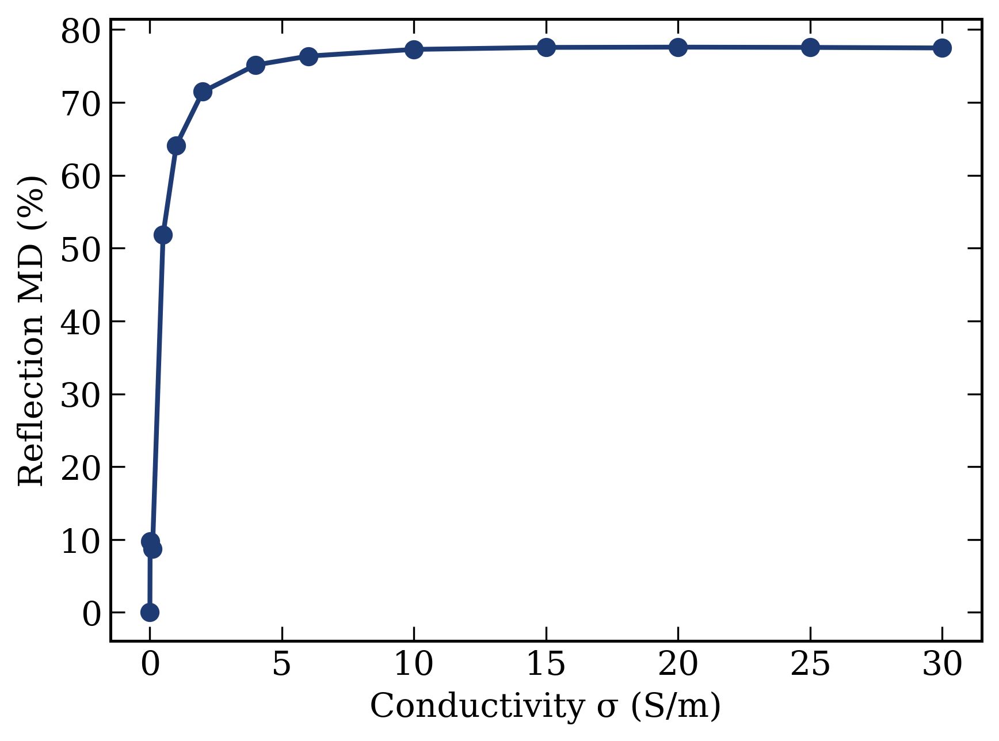

# THz Metasurface Modulator Analysis

Automated analysis pipeline for terahertz metasurface modulators based on
Fe:Ga₂O₃, processing HFSS simulation exports into publication-ready figures.

## What this does
- Loads HFSS Floquet-port reflection sweeps across 13 conductivity states (σ = 0–30 S/m)
- Automatically locates the resonance and computes reflection modulation depth (MD)
- Generates journal-grade figures (300 DPI PNG + vector PDF)

## Key result
A complementary split-ring resonator (C-SRR) on Fe:Ga₂O₃ reaches ~77.5% reflection
modulation depth at 300.4 GHz, saturating near σ ≈ 15 S/m (critical-coupling limit).

## Stack
Python · pandas · matplotlib · Ansys HFSS
